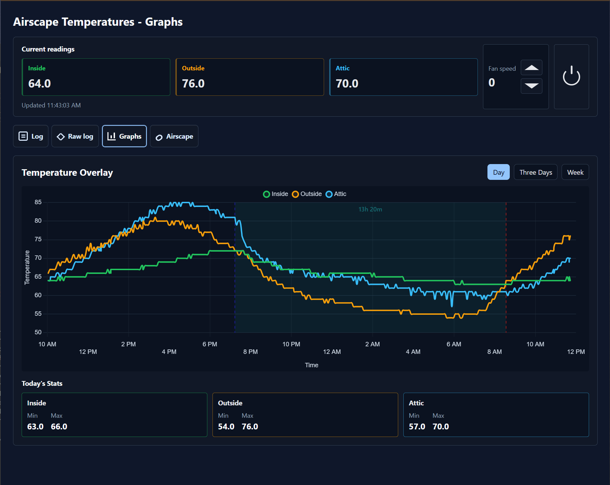
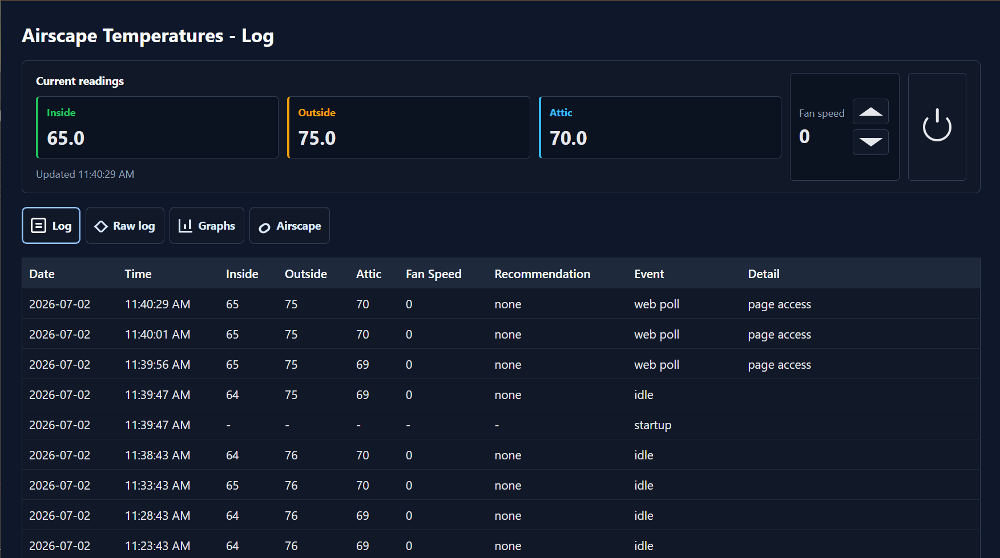
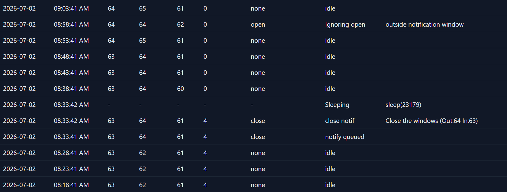

The following program can be compiled remotely using the makefile commands, in
particular `make kill` for removing dupe processes, then `make run` for 
running. However, this program is meant to be run continuously. As a result, 
a few commands can be found within the makefile for managing the service.
In particular, you can run `make disable`, `make enable`, and `make restart`
for starting the machine. To pull the latest GitHub changes on the running system,
rebuild the program, and restart the service in one command, run `make deploy`.
As a final note, the makefile is meant to be used remotely on a windows machine
that has ssh. If you wish to run it on a different environment, then you simply
must change the ssh directory.

The code is split by responsibility:

- `src/houseNotif.c` owns process startup and long-running orchestration.
- `src/house/` owns house config, polling, recommendations, sensor reads, and fan control.
- `src/json/` contains side-effect-free JSON helpers.
- `src/lock/` handles the local process lock.
- `src/logApp/` owns application startup logging and web controls.
- `src/logger/` contains the reusable log writer/trimmer module.
- `src/http/` contains the reusable libcurl HTTP client module.
- `src/portable/` wraps platform differences for env vars, sleep, time, and PID.
- `src/settings.h` contains shared compile-time settings.
- `src/logger/loggerSettings.h` contains logger and logger-web compile-time settings.
- `tests/` contains small focused test programs.

Each module folder contains its public header and implementation file, so it can
be copied into another C program as a unit. Shared dependencies live under
`src/` as folders too; there is no separate root `include/` directory.

Run `make test` to compile and execute the small core test binary on the
remote host. Run `make build` to compile the full notifier.

Run `make notify-test-build` to compile the notification smoke-test program
without sending a notification. Run `make notify-test` to compile it and send a
Pushover test notification using `keys.env`. The test message can be overridden
by setting `TEST_NOTIFICATION_MESSAGE` in the remote environment before running
`./test_notification`.

CMake is available for local focused builds and CI while the Makefile remains
the deployment path. On the local Windows machine, use the checked-in CMake
presets so VS Code does not need to ask for a compiler kit:

```powershell
cmake --preset windows-msvc-tests
cmake --build --preset windows-msvc-tests-debug
ctest --preset windows-msvc-tests-debug
```

The VS Code default build task runs the same local test build. The automated
local CTest suite covers the core test, logger test, and a logger-web startup
smoke test. The notification test is intentionally not part of CTest because it
sends a real Pushover notification; run it explicitly with `make notify-test` on
the remote host.

To view the same logger web setup used by the real app, run the VS Code task
`Run local logger web`, or run the built executable directly:

```powershell
.\\out\\build\\windows-msvc-tests\\Debug\\test_logger_web.exe .\\house_notify.log 8080 --open
```

The local viewer uses the production logger-web configuration from
`appStartLoggerWeb`. It shows the Today fan controls, but wires them to local
no-op callbacks so simply opening or clicking it on Windows cannot call the
house controller. It also appends a few recent sample rows when the selected log
has no data in the default graph range.

To build every available local target, use `cmake --preset windows-msvc` and
then `cmake --build --preset windows-msvc-debug`; the full `houseNotif` target
still requires libcurl and is skipped when libcurl is not installed.

The logger web server defaults to `127.0.0.1`, renders the newest 500 log rows
unless `?limit=` is provided.

To inspect the logger web UI locally (including Windows), build with CMake and
run `test_logger_web` directly. The test now supports defaults and optional
auto-open:

- `test_logger_web` uses `house_notify.log` and port `8080`.
- `test_logger_web --open` also opens your default browser.
- `test_logger_web path\\to\\log.txt 8090 --open` uses a custom log and port.

When no log file exists yet, the test writes a tiny sample log so the page has
immediate content. Press Enter in the terminal to stop the local server.
Images:

The current root directory, which is the graph page and shows the multi-series graph with event markers


The log directory, which the logger set up and important events such as the page access.


A demonstration within the log of how a notification works, which in this case is closing windows.
